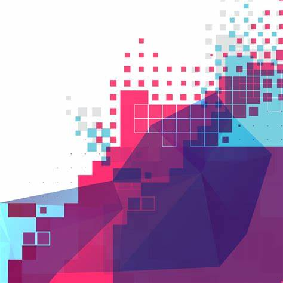

# Gamers Unite


---

## Live Site
[Gamers Unite]()

---

## Contents

- [Gamers Unite](#gamers-unite)
    - [Live Site](#live-site)
    - [Contents](#contents)
    - [Objective](#objective)
    - [Goals](#goals)
    - [User Stories](#user-stories)
        - [First Time Users](#first-time-users)
        - [Returning Users](#returning-users)
        - [Implementing User Stories](#implementing-user-stories)
    - [Website Design](#website-design)
        - [Colour Scheme](#colour-scheme)
            - [Background Colours](#background-colours)
            - [Text Colours](#text-colours)
        - [Font Families](#font-families)
        - [Images](#images)
    - [Features](#features)
        - [Implemented Features](#implemented-features)
        - [Future Features](#future-features)
    - [Testing](#testing)
        - [Bugs Found](#bugs-found)
        - [Bugs Fixed](#bugs-fixed)

---
## Objective

Build a Full-Stack site based on business logic used to control a centrally-owned dataset. Set up an authentication mechanism and provide role-based access to the site's data or other activities based on the dataset.

[Back to contents](#contents)

---

## Goals

The goal of this website is to provide a place where users can post about games they play, and when they play their games so that other users can play if they wish. The program should:

- Be error free within the program
- Have login/ logout functionality
- Have the ability to like and unlike posts
- Have the ability to create, edit and remove a post
- Have the ability to create, edit and remove comments on posts
- Have the ability to follow another user, putting their posts at the top of the logged in users page

[Back to Contents](#contents)

---
## User Stories

*The user stories created have given me a guide on what to add to the site*

### First Time Users

- >As a **first time user**, I can **view a post** so that **I can see clearly what the site is for**
- >As a **first time user**, I can **view comments** so that **I can see what other people are saying about posts**

---

### Returning Users

- >As a **returning user**, I can **register for an account** so that **I can follow other users**
- >As a **returning user**, I can **like posts** so that **I can show the post creator I like their content** 
- >As a **returning user**, I can **comment on posts** so that **I can show people what I think about a post**
- >As a **returning user**, I can **view user profiles** so that **I can see more about a user, and view all posts by that user**

---

### Implementing User Stories

For this project, I intend to follow the user stories. The requirements based on the user stories for the completion of this project are:

- >Viewing posts
- >Account registration
- >Creating new posts
- >Liking posts
- >Commenting on posts

Based on the user stories, optional additions which I will attempt to add to add to this project are:

- >Following users
- >Creating a user profile
    - >Viewing a user profile
    - >Viewing posts by individual users
All optional additions I will attempt to add to the final product before submission. Anything not added on final submission, will be added to [Future Ideas]()

[Back to contents](#contents)

---
## Website Design

The idea on the design of this website is to be viewed as a gaming website, with a pixelated site name, and fun looking headers and paragraphs for the rest of the page.

### Colour Scheme

These are the colours used for the website, separated by each loacation used

#### Background colours
- `#001css` is used as an alternate background colour incase the image doesn't render
- `#0000008a` is used for the header and footer background
- `#f0f8ff` is used as the background colour for each of the cards
- `#ff0000` is used as the background colour for each submit button

---

#### Text Colours
- `#808080` is used for the links to each post created
- `#a9a9a9` is used for a hover effect on each post link
- `#ffffff` is used for each button press, e.g: create post link, submit buttons
- `#000000` is used as a hover effect on each button
- `#212529` is used for the text in every text that isn't colour customized

[Back to Website Design](#website-design)    
[Back to Contents](#contents)

---

### Font Families

There are only 2 external font families used across the site, plus the default font family, and a fallback font for each external font. They are:

- >**Press Start 2P** is used whenever **Gamers Unite** is shown in the browser, which comes from [Google Fonts](https://fonts.google.com/specimen/Press+Start+2P)
- >**Default Font** is used at the footer of the page, which shows who created the website
- >**kalam** is used for every other part of the page, and comes from [Google Fonts](https://fonts.google.com/specimen/Kalam)
- >**Cursive** is used as a fallback font, where either or both of the external fonts don't work on a browser

[Back to Website Design](#website-design)    
[Back to Contents](#contents)

---

### Images

The only image used, is as a background used across the site, which is below



Any other images that are used on the website, are images posted by users, which are stored in [Cloudinary](https://cloudinary.com/)

[Back to Website Design](#website-design)    
[Back to Contents](#contents)

---

## Features

This page contains the features implemented up to the current development stage, plus features to be implemented in future stages. Future features will be ordered by importance, with the most important feature to add at the top of the list.

### Implemented Features

These features are fully implemented

- Registration - Register for an account, which'll eventually allow the user to post, comment, like other's posts and follow other users
- Login - Login to an account as a user to be able to post, comment, like posts and follow other users when implemented
- Logout - Logout of an account so that if a computer is shared, someone else doesn't have access to your account
- Viewing Posts - View a posts contents and comments
- Comment on a post - Comment on posts so you can show what you're thinking

---

### Future Features

These features are either partially implemented, or to be worked on in the future

- Create a post - Post what game you're playing, and about what you enjoy playing
- Like/ unlike - Like a post by another user to show you like the game they're playing/ talking about, or unlike it for accidental likes
- Create a user profile - Create a bio to tell people a little bit about yourself and add a picture of yourself. A profile will also contain each post created by the user
- Follow a user - Follow a user so that you can view that users posts before any others
  
[Back to Contents](#contents)

---

## Testing

This website was mostly tested manually. Therefore, below is bugs that had been found throughout the program, whether they were found before or after committing the changes to github.

### Bugs found
These are the bugs found whilst programming 

1. Custom styles not working on the website
2. Navbar moving upwards when there was a large number of comments
3. Posts wouldn't load when clicked on
4. **Leave a comment** card extended down past **comments** card.

--- 

### Bugs Fixed
These are the fixes for each bug, in the same order as each bug found in [bugs found](#bugs-found)

1. In **settings.py**, I found 
    ```python
    STATICFILES_DIR = [os.path.join(BASE_DIR, 'static')]
    ```
    instead of 
    ```python
    STATICFILES_DIRS = [os.path.join(BASE_DIR, 'static')]
    ```
    Once this had been fixed, my custom styles started to work

2. In **base.html**, change
    ```html
    <nav class="navbar sticky-top navbar-expand-lg navbar-dark dark-bg">
    ```
    to
    ```html
    <nav class="navbar fixed-top navbar-expand-lg navbar-dark dark-bg">
    ```
    after that change, the navbar stays at the top of the page whenever the user scrolls down, making it easier for the user to navigate to the home page, or login/out

3. Changed the file name from **post_details.html** to **post_detail.html**
4. In **post_detail.html**, changed from 
    ```html
    <div class="col-md-4 card md-4 mt-3">
    ```
    to
    ```html
    <div class="col-md-4 card mb-4 mt-3">
    ```
    This minor change added a bottom margin to the **Leave a comment** card, which made this card in line with the **comments** card.

[Back to Testing](#testing)   
[Back to Contents](#contents)

---
